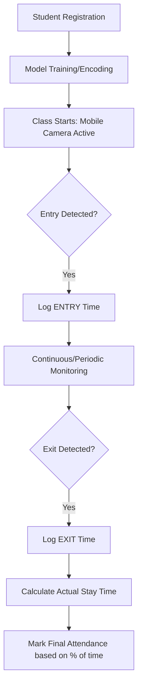
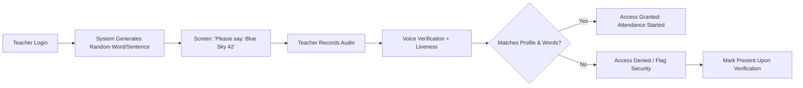

# 📊 Cloud-Based Attendance System: Requirements & Flow

This document outlines the specialized requirements and operational workflows for the **Next-Gen Attendance System**, focusing on student activity logging and teacher voice-security.

---

## 🎯 Main Objectives

| Participant | Goal | Method |
| :--- | :--- | :--- |
| **Student** | Automated Session Tracking | Real-time entry/exit detection via mobile camera |
| **Teacher** | Anti-Spoofing Authentication | Dynamic sentence-based voice verification |

---

## 🛠️ System Requirements

### 1. Registration Phase
- **Student Form Data**:
  - Full Name
  - Permanent Registration Number (PRN)
  - Roll Number
  - High-Resolution Enrollment Photo (for training)
- **Teacher Form Data**:
  - Full Name
  - Employee ID
  - Voice Profile (3-5 baseline recordings)

### 2. AI & Deep Learning Stack
- **Face Detection**: MediaPipe / OpenCV (MTCNN)
- **Face Recognition**: FaceNet / InsightFace (ResNet-100)
- **Voice Recognition**: Resemblyzer / SpeakerEncoder (GE2E Loss)
- **Liveness Detection**: 
  - **Eyes**: Blink detection
  - **Voice**: Spectral analysis to detect TTS (Text-to-Speech) or Replay attacks.

### 3. Hardware Requirements
- **Mobile Device**: Camera with 720p+ resolution, active internet connection.
- **Server**: Cloud-based (AWS/Azure/GCP) or Oracle Cloud Free Tier.

---

## 🔄 Operational Flows

### 🟦 Student Activity Flow (Session Tracking)

The system doesn't just mark "present" once; it logs the **entire duration** of the student's presence.



**Key Implementation Detail:**
- **Activity Log**: Every Entry/Exit event is stored in the `EntryExitLog` collection.
- **Duration Calculation**: 
  - `Actual Duration = Σ (Exit_Time_n - Entry_Time_n)`
  - This handles scenarios where a student leaves for 5 minutes and returns.

---

### 🟨 Teacher Authentication Flow (Secure Voice)

Designed to prevent **Voice Clones/Deepfakes** using a challenge-response mechanism.



**Security Features:**
1. **Dynamic Prompt**: The sentence is random, so a pre-recorded clone cannot be reused.
2. **Text-to-Speech Check**: The model verifies that the words spoken match the "Suggested Sentence" and that the voice shows natural human spectral variance.

---

## 📈 Attendance Calculation Logic

For a standard 60-minute class:

| Scenario | Logic | Result |
| :--- | :--- | :--- |
| **Full Attendance** | Duration ≥ 50 mins | **Present (100%)** |
| **Partial Attendance** | 30 mins ≤ Duration < 50 mins | **Partial (50%)** |
| **Late Entry/Early Exit** | Total recorded time used for analysis | **Logged in History** |

---

## 🔒 Security & Data Integrity

- **Anti-Deepfake**: The voice model uses **Embedding Similarity** combined with **Word Matching**.
- **Data Privacy**: No raw images or audio are stored permanently. Only 128-d (Face) and 256-d (Voice) math vectors (embeddings) are saved in the cloud.
- **Cloud Sync**: All logs are synced to **MongoDB Atlas** in real-time, preventing local tampering.

---

## 📂 Folder Structure

```
project/
├── requirement and flow.md    # This documentation
├── backend/                   # Node.js API & MongoDB Logic
├── face_service/              # Python FastAPI (Face Analytics)
├── voice_service/             # Python FastAPI (Voice Analytics & Liveness)
└── mobile_app/                # Student/Teacher UI (React Native)
```

---

*Prepared by Antigravity AI* 🚀
